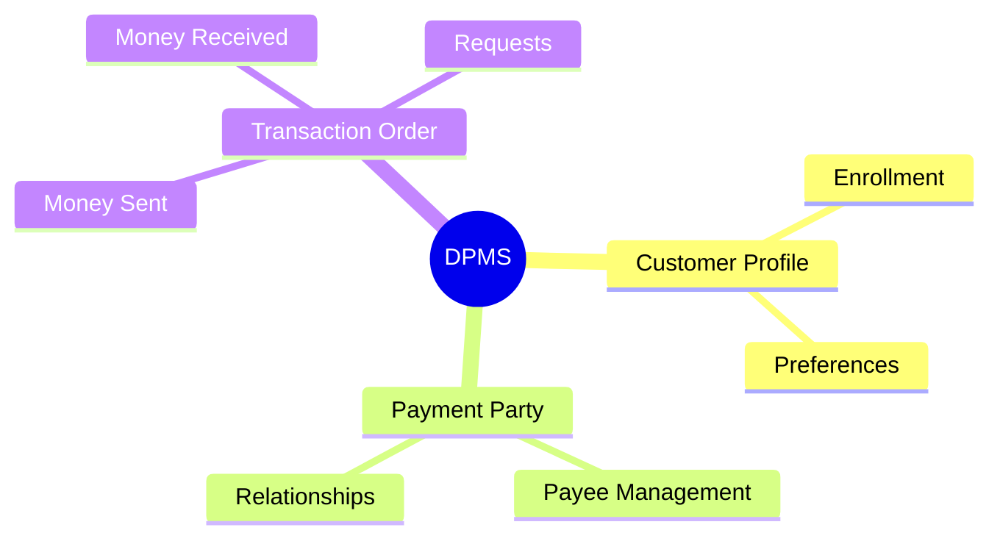
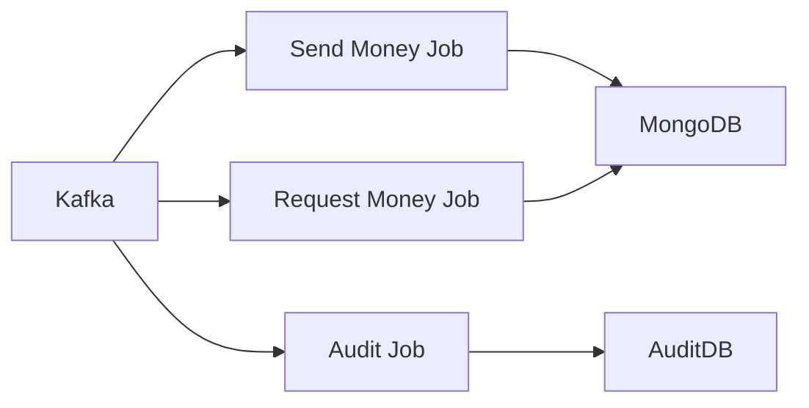
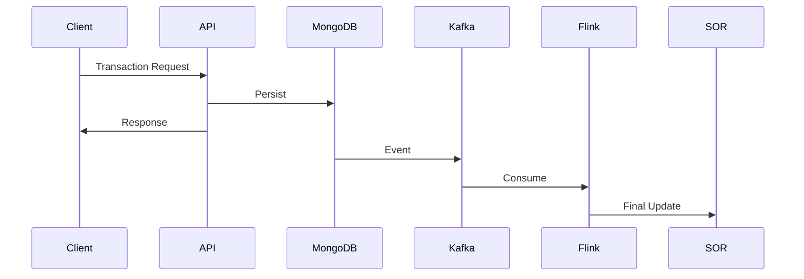
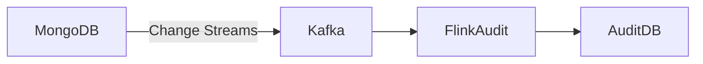

# DPMS – Digital Payments Microservices Platform

## 1. Overview
DPMS (Digital Payments Microservices) is a modern, event-driven digital payments platform designed to support high-volume, low-latency payment products such as Zelle, InterFi, wires, and future digital payment capabilities.

DPMS combines domain-driven microservices, event streaming, and stateful stream processing to deliver performance, resilience, auditability, and scalability by design.

---

## 2. Why DPMS? (Legacy to Modern)

### Legacy Stack ()
- Monolithic Java + Spring applications
- Business logic embedded in PL/SQL stored procedures
- Centralized Oracle Database
- SOAP / REST / MQ integrations

### Limitations
- Slow release cycles
- Difficult scalability
- High database contention
- Limited fault isolation

---

## 3. Domain Driven Design (DDD)

### Core Domains
- **Customer Profile**: Enrollment, un-enrollment, preferences
- **Payment Party**: Customer–payee relationships
- **Transaction Order**: Money sent/received, requests, transaction lifecycle

---

## 4. Technology Stack
- API Layer: Spring Boot microservices
- Data Layer: MongoDB
- Event Backbone: Apache Kafka
- Stream Processing: Apache Flink

---

## 5. Apache Flink Job Design (SRP)

Each business flow is handled by a separate Apache Flink job.

### Benefits
- Single Responsibility Principle (SRP)
- Independent scaling per flow
- Fault isolation
- Faster recovery

---

## 6. Performance & Scalability

### MongoDB
- High write throughput
- Horizontal scaling via sharding
- Low-latency reads
- Change Streams for real-time capture

### Apache Kafka
- High-throughput event streaming
- Decoupled producers and consumers
- Backpressure handling

### Apache Flink
- Stateful stream processing
- Exactly-once semantics
- Horizontal scalability
- Automatic recovery

---

## 7. End-to-End Transaction Flow

---

## 8. Audit & Compliance

- Automatic audit capture
- Near real-time propagation
- No application-level audit logic

---

## 9. Design Principles
- Domain Driven Design
- Single Responsibility Principle
- Event-Driven Architecture
- Asynchronous Processing
- Horizontal Scalability
- Fault Tolerance
- Auditability by Default

---

## 10. Key Takeaway
DPMS is engineered for payment-grade performance, correctness, and scalability, enabling faster innovation and safer digital payments.
